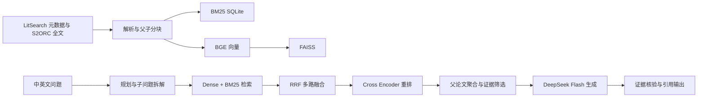

# 架构速览

## 数据和索引

每篇论文是一个父文档，论文段落构成子块。子块保留稳定标识和来源位置，便于从检索结果回溯证据。BM25 用于精确词项匹配，BGE/FAISS 用于语义检索；RRF 在不直接比较两种分数尺度的情况下融合排名。

每次建库生成语料哈希和索引元信息。Dense 映射侧车把 FAISS 位置关联到子块，子块再关联父论文。元信息不匹配时，加载器应报错而不是静默使用过期索引。

## 查询与回答

规划模块把复合问题拆成有限数量的检索表达，Dense 与 BM25 对每个查询独立排序，再按块 ID 做融合。复核模块可以触发有限的第二轮查询。Cross Encoder 重新评估融合后的候选，再将子块去重并归并到父论文。

生成上下文来自检索到的原文块。回答中的引用编号映射到来源论文与证据块；核验步骤检查每个主张能否从对应原文得到支持，证据不足时允许拒答。

完整全文语料和模型文件不在 GitHub 上传版中。请先按 [README 的试点步骤](../README.md#构建100-篇全文试点)准备本地数据。
